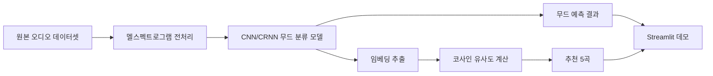

# music-mood-recs PRD

## 0. 문서 메타데이터

| 항목 | 값 |
| --- | --- |
| 상태 | Draft (6일 데드라인 범위로 조정 완료) |
| 담당자 | 본인 (단독 개발) |
| 마지막 업데이트 | 2026-06-25 |
| 목표 릴리즈 또는 마일스톤 | **2026-07-01 09:00 발표·시연·제출** (딥러닝 모델 과제) |
| 학습 환경 | CPU(로컬, torch CPU 빌드) — GPU 없음 |
| 원천 후보 | `../ai-service-blueprints/_workspace-docs/topic-brainstorming.md` `T-026` |
| Phase | `0`(MVP, 본 문서) |
| 관련 문서 | [`docs/prd-phase-1-streaming-integration.md`](prd-phase-1-streaming-integration.md)(Phase 1, 외부 스트리밍 연동) |

### 변경 이력

| 날짜 | 변경 | 이유 |
| --- | --- | --- |
| 2026-06-25 | 최초 초안 | career 세션에서 사전 검증을 마친 컨셉(T-026)을 PRD로 승격 |
| 2026-06-25 | 데이터셋 확정: MTG-Jamendo 무드/테마 서브셋 채택 | §24 열린 질문 1번 해결 — 용량·라이선스·무드 태그 체계 비교 후 MTG-Jamendo 채택, MagnaTagATune은 라벨 노이즈·태그 혼재로 배제. 상위 10~15 태그 서브셋 전략 |
| 2026-06-25 | 과제 제출 요건 반영 + 6일 CPU 현실적 범위 축소 | 7/1 09:00 발표 데드라인, CPU 전용 학습 환경, 산출물(ipynb+py+보고서 PPT) 추가. 데이터 서브셋 5,000~8,000곡 → 1,000~2,000곡(상위 5~8 태그, 30초 세그먼트), CRNN·평가 심화는 P1(보완사항)으로 이월 |

## 1. 문서 목적

이 PRD는 music-mood-recs의 **Phase 0(MVP)** 범위를 정의한다.

- **다루는 범위**: 음악 오디오 무드 분류 모델 학습(CNN/CRNN, 멜스펙트로그램 입력), 분류 임베딩을 재사용한 콘텐츠 기반 추천(코사인 유사도), Streamlit 데모 앱, 모델 평가.
- **다루지 않는 범위**: 외부 스트리밍 서비스 연동(Spotify 등 실제 음원 재생/검색), 모바일 앱, 실시간 마이크 입력 무드 분류, 사용자 계정/인증, 다중 사용자 개인화. 이들은 Phase 0과 다른 도메인/기술 영역이므로 [`docs/prd-phase-1-streaming-integration.md`](prd-phase-1-streaming-integration.md) 등 별도 phase 문서에서 다룬다.
- **이 문서로 내릴 결정**: 데이터셋 선정, 베이스라인 모델 구조, MVP 시연 범위, 추천 방식(임베딩 재사용 vs 별도 모델), 평가 방식.

## 2. 프로젝트 개요

music-mood-recs는 음악 오디오(MTG-Jamendo 또는 MagnaTagATune)에서 멜스펙트로그램을 추출해 CNN/CRNN으로 무드를 분류하고, 분류 과정에서 학습된 임베딩을 코사인 유사도로 재사용해 콘텐츠 기반 추천까지 보여주는 **단일 모델·단일 데이터셋·단일 도메인** DL 포트폴리오 프로젝트다. Streamlit에서 "곡 선택 → 무드 예측 → 비슷한 무드 추천 5곡" 흐름을 시연한다.

| 항목 | 값 |
| --- | --- |
| 스택 | Python · PyTorch(오디오 CNN/CRNN) · librosa(멜스펙트로그램) · scikit-learn(코사인 유사도) · Streamlit |
| 데이터 | MTG-Jamendo 무드/테마 서브셋 — 상위 5~8 태그, 약 1,000~2,000곡, 30초 세그먼트(2026-06-25 확정, 6일 CPU 환경에 맞춰 축소) |
| 모델 | 단순 CNN 베이스라인(CRNN은 P1 보완사항으로 이월) |
| 배포 | Streamlit Cloud (예정) |

### 2.1 후보에서 승계한 결정

| 구분 | 내용 | 원천 또는 검증 방법 |
| --- | --- | --- |
| 유지할 결정 | 무드 분류 + 콘텐츠 기반 추천을 단일 모델·단일 데이터셋 파이프라인으로 통합 | career 세션에서 "이어붙인" 2단 파이프라인 초안을 폐기하고 확정(`T-026`) |
| 유지할 결정 | 분류용 임베딩을 추천에 재사용(별도 추천 모델 학습 없음) | MVP 범위 내 완결성 확보 목적 |
| 유지할 결정 | Streamlit 데모, "곡 선택 → 무드 예측 → 추천 5곡" 흐름 | `review-sentiment` Streamlit 패턴 재사용 |
| 다시 검증할 가정 | 분류용 임베딩이 추천에도 충분한 무드 유사도 신호를 담고 있는지 | 베이스라인 학습 후 추천 결과 정성 평가로 확인 필요 |
| 확정된 결정 | MTG-Jamendo 무드/테마 서브셋 채택(상위 10~15 태그 추가 필터) | 2026-06-25 용량·라이선스·무드 태그 체계 비교 완료. MagnaTagATune은 라벨 노이즈·188태그 혼재로 "무드 분류" 스토리가 흐려져 배제(§24 Q1 해결) |

## 3. 프로젝트 목표

### 3.1 문제 정의

- **사용자가 원하는 결과**: 기존 DL 포트폴리오 2건(`review-sentiment`=텍스트 감성분류, 무디트리=텍스트/UI)이 모두 텍스트 계열에 쏠려 있어, 오디오 모달리티와 추천 시스템 기술을 보여줄 세 번째 프로젝트가 필요하다.
- **사용자가 그 결과를 원하는 이유**: 채용 담당자에게 텍스트 외 모달리티(오디오)와 추천 알고리즘 경험을 동시에 증명하기 위함.
- **현재 상태의 고통 또는 한계**: 동료 DL 산출물 샘플 12건 중 음성/오디오·추천시스템 계열이 0건으로, 이 영역에서 변별력 있는 산출물이 부재하다.
- **근거 출처 또는 확신 수준**: High — career 세션에서 동료 샘플 12건 전수 확인 및 후보 비교·배제를 거쳐 검증 완료(`T-026` 결정 근거).

## 4. 목차

- 문서 메타데이터
- 문서 목적
- 프로젝트 개요
- 프로젝트 목표
- 문제 정의
- 타깃 사용자
- 대안과 차별점
- 핵심 가치 제안
- MVP 범위
- 사용자 흐름
- 상호작용 인터페이스 요구사항
- 제품 또는 시스템 요구사항
- 인수 조건
- 비기능 요구사항
- 엣지 케이스와 에러 처리
- 아키텍처 개요
- 프로토타입 범위
- 데이터 요구사항
- 개인정보와 보안 요구사항
- 성공 지표
- 우선순위
- 가정과 검증
- 주요 리스크
- 회고
- 열린 질문
- 참고 자료

## 5. 타깃 사용자

### 5.1 주요 사용자

- DL 포트폴리오를 완성해야 하는 본인.
- 채용 담당자 또는 포트폴리오 평가자.

### 5.2 초기 집중 사용자

- 포트폴리오 리뷰를 진행하는 면접관, Streamlit 링크로 직접 곡을 선택해보는 평가자.

### 5.3 비타깃 사용자

- 실제 음원 스트리밍/재생을 원하는 일반 음악 청취자(Phase 0은 공개 데이터셋 메타데이터 기반 데모이며 실음원 스트리밍은 다루지 않음, Phase 1 참고).
- 실시간 마이크 입력으로 무드를 분석하려는 사용자(다른 기술 영역, Phase 분리 대상).

### 5.4 사용자 문제

- 텍스트 외 모달리티(오디오)와 추천 시스템 기술을 함께 보여줄 포트폴리오 산출물이 없다.

## 6. 대안과 차별점

기존 포트폴리오 `review-sentiment`(텍스트 감성분류)와 무디트리(텍스트/UI, ML 모델 없음)가 사실상의 대안이지만 모달리티가 다르다. 상업 시장 비교는 해당 없음(취업 포트폴리오 목적의 개인 프로젝트).

## 7. 핵심 가치 제안

곡을 선택하면 무드를 예측하고, 같은 모델의 임베딩을 그대로 재사용해 비슷한 무드의 곡 5개를 추천한다 — 분류와 추천을 별도 파이프라인으로 이어붙이지 않고 하나의 모델로 증명한다.

## 8. MVP 범위

| 포함 범위 | 제외 범위 | 이유 |
| --- | --- | --- |
| 무드 태그 데이터셋 서브셋 확보, CNN/CRNN 분류 학습, 임베딩 기반 추천, Streamlit 데모 | 외부 스트리밍 서비스 연동(실음원 재생) | 다른 기술 영역(외부 API 연동) — Phase 1로 분리 |
| | 모바일 앱 | 다른 플랫폼 영역 — 필요 시 별도 phase로 분리 |
| | 실시간 마이크 입력 무드 분석 | 배치 분류와 다른 기술 영역(실시간 오디오 캡처) — 필요 시 별도 phase로 분리 |

### 8.1 포함

- 무드 태그 포함 공개 데이터셋 **MTG-Jamendo 무드/테마 서브셋**(18,486곡, 56 mood/theme 태그)에서 **상위 5~8 태그**로 추가 필터한 서브셋(약 1,000~2,000곡) 확보. **곡당 30초 세그먼트 1개** 사용(CPU 학습 시간 절감).
- 멜스펙트로그램 추출 전처리.
- **단순 CNN 베이스라인 학습**(CRNN 확장은 P1 보완사항으로 이월, 6일 데드라인 내 불가능).
- 분류 임베딩 추출 및 코사인 유사도 기반 Top-5 추천.
- Streamlit "곡 선택 → 무드 예측 → 추천 5곡" 데모.
- 모델 성능 평가(분류 정확도/F1) 및 추천 결과 정성 평가.
- **과제 산출물**: 학습 노트북(ipynb) + 소스(py) + 발표 시연(Streamlit Cloud/로컬 IP) + 보고서(PPT, 양식 준수).

### 8.2 제외

- CRNN 확장, 하이퍼파라미터 튜닝 심화 — 보고서 "5. 보완사항 및 개선점"으로 서술(P1 이월).
- 추천 정량 평가 지표 설계 — 보고서 "5. 보완사항"으로 서술(P1 이월, §24 Q3).
- 실제 음원 스트리밍 재생, 외부 음악 서비스 API 연동 — [`docs/prd-phase-1-streaming-integration.md`](prd-phase-1-streaming-integration.md).
- 모바일 앱, 실시간 마이크 입력 — 필요해지면 별도 phase 문서로 분리.
- 다중 사용자 계정, 개인화 추천 — MVP는 단일 데모 사용자 기준.

## 9. 사용자 흐름

1. 사용자가 Streamlit 화면에서 데모용 곡 목록 중 하나를 선택한다.
2. 시스템이 해당 곡의 멜스펙트로그램을 모델에 입력해 무드를 예측한다.
3. 예측 무드와 확률을 화면에 표시한다.
4. 같은 모델의 임베딩으로 코사인 유사도가 높은 곡 5개를 계산해 추천 목록으로 표시한다.
5. 사용자가 다른 곡을 선택해 흐름을 반복할 수 있다.

## 10. 상호작용 인터페이스 요구사항

| 인터페이스 | 행동 |
| --- | --- |
| Streamlit 웹 데모 | 곡 선택, 무드 예측 결과 표시, 추천 5곡 표시 |
| CLI/노트북(학습 스크립트) | 데이터 전처리, 모델 학습, 평가 실행 — 개발자(본인)만 사용 |

## 11. 제품 또는 시스템 요구사항

| 요구사항 ID | 요구사항 | 사용자 이야기 또는 시나리오 | 우선순위 | 비고 |
| --- | --- | --- | --- | --- |
| PR-001 | 무드 태그 데이터셋 서브셋을 확보하고 전처리(멜스펙트로그램 추출)한다 | 학습 가능한 형태의 입력 데이터를 준비 | P0 | 상위 5~8 태그, 약 1,000~2,000곡, 30초 세그먼트 |
| PR-002 | 단순 CNN 기반 무드 분류 모델을 학습한다 | 곡의 멜스펙트로그램을 입력하면 무드 클래스를 예측 | P0 | CPU 학습, CRNN은 P1 보완사항으로 이월 |
| PR-003 | 분류 모델의 임베딩을 추출해 코사인 유사도 기반 추천을 계산한다 | 선택한 곡과 비슷한 무드의 곡 5개를 제시 | P0 | 별도 추천 모델 학습 없음 |
| PR-004 | Streamlit 데모 앱에서 곡 선택 → 무드 예측 → 추천 5곡 흐름을 보여준다 | 평가자가 직접 곡을 선택해 결과를 확인 | P0 | 발표 시연(Streamlit Cloud/로컬 IP) |
| PR-005 | 모델 성능(정확도/F1)과 추천 결과를 평가·기록한다 | 포트폴리오·보고서 설명 자료로 사용 | P1 | 추천은 정량 지표가 약해 정성적 사례 비교 위주 |
| PR-006 | 학습 노트북(ipynb)과 소스(py)를 산출물로 제출한다 | 과제 제출 요건 — ipynb+py+보고서 zip | P0 | 노트북=학습 전 과정, py=데모 소스 |
| PR-007 | 발표 보고서(PPT, 양식 준수)를 작성한다 | 7/1 발표·시연, 20슬라이드 양식(개요/데이터/EDA/모델/학습/예측/프로토타입/보완/후기) | P0 | 양식: 딥러닝 산출물_20250312(홍길동v0.1).pptx |

## 12. 인수 조건

```text
Given Streamlit 데모가 실행 중일 때
When 사용자가 데모 목록에서 곡을 선택하면
Then 예측 무드와 확률, 비슷한 무드의 추천곡 5개가 화면에 표시된다
```

```text
Given 무드 분류 모델 학습이 완료되었을 때
When 테스트셋으로 평가하면
Then 분류 정확도/F1 점수가 §19 성공 지표 기준을 충족하거나, 충족하지 못한 이유와 다음 시도가 기록된다
```

## 13. 비기능 요구사항

| 범주 | 요구사항 | 측정 기준 또는 표준 | 우선순위 |
| --- | --- | --- | --- |
| 성능 | Streamlit Cloud 무료 티어(메모리 제한) 안에서 모델 로드·추론 가능 | OOM 없이 데모 실행 | P0 |
| 신뢰성 | 추천 결과가 매 실행마다 동일한 곡에 대해 동일하게 나옴(결정적 계산) | 코사인 유사도 계산은 비확률적 | P1 |
| 보안 · 개인정보 | 해당 없음 | 사용자 계정·개인 데이터 없음, 공개 데이터셋만 사용 | — |
| 접근성 | 해당 없음 | 단일 데모 사용자(본인) 기준, 접근성 요구사항 별도 없음 | — |
| 가용성 | 해당 없음 | 상시 운영 서비스가 아닌 포트폴리오 데모 | — |

## 14. 엣지 케이스와 에러 처리

| 상황 | 기대 동작 | 사용자 메시지 또는 복구 방법 | 우선순위 |
| --- | --- | --- | --- |
| 데모 목록에 없는 곡 입력 | 입력 자체를 차단(데모는 사전 등록된 곡 목록에서만 선택) | 선택 UI로 제한해 잘못된 입력 자체를 방지 | P0 |
| 모델 추론 실패(파일 누락 등) | 에러 메시지 표시, 앱 크래시 방지 | "모델을 불러오지 못했습니다" 안내 | P1 |
| 추천 후보가 5개 미만(데이터 서브셋이 작을 때) | 가능한 만큼만 표시 | 추천 개수를 명시("이 무드와 비슷한 곡 N개") | P2 |
| 잘못된 입력 | 해당 없음 | UI에서 자유 입력이 아닌 선택형이라 발생하지 않음 | — |

## 15. 아키텍처 개요



별도 백엔드 서버 없이 학습 스크립트 + Streamlit 단일 페이지 앱으로 구성한다. 상세 구현 설계는 필요해지면 `docs/architecture.md`에 작성한다.

## 16. 프로토타입 범위

- 증명할 것: 분류용으로 학습한 임베딩이 추천에도 쓸 만한 무드 유사도 신호를 담는지, CNN/CRNN 베이스라인이 합리적인 분류 성능을 내는지.
- 시도하지 않을 것: 별도 추천 전용 모델 학습, 대규모 데이터셋 전체 학습(서브셋으로 충분).

## 17. 데이터 요구사항

핵심 엔티티는 곡(오디오 파일 또는 메타데이터), 무드 태그, 멜스펙트로그램(전처리 산출물), 임베딩(모델 산출물)이다. 영속 DB 없이 파일 시스템 기반으로 관리하며 상세는 필요 시 `docs/data-model.md`에 작성한다(현재는 `docs/README.md`에 해당 없음으로 표시).

### 17.1 데이터셋 확정 (2026-06-25)

| 항목 | 값 |
| --- | --- |
| 데이터셋 | MTG-Jamendo(무드/테마 서브셋) |
| 근처 서브셋 | `autotagging_moodtheme.tsv` — 18,486곡, 56 mood/theme 태그(정식 분할 기준) |
| 추가 필터 | 빈도 상위 5 태그(happy, energetic, relaxing, film, dark) — train 3,699 / val 1,272 / test 1,754 (총 6,725곡, 실측 2026-06-25) |
| 오디오 형식 | audio-low(모노 LAME VBR 2, 저품질) — 전체 무드/테마 46GB 중 필요분만 추출 |
| 세그먼트 | 곡당 30초 세그먼트 1개 사용(CPU 학습/추론 시간 절감) |
| 분할 | 공식 train/val/test 5분할(split-0 사용, 태그 선택은 TRAIN 기준으로 test 누수 방지) |
| 라이선스 | 메타데이터 CC BY-NC-SA 4.0, 오디오 개별 CC 라이선스, 비상업 연구용 |
| 멜스펙 | 직접 계산(파이프라인 전체 증명 목적, 사전계산 분은 미사용) |
| 배제 | MagnaTagATune — 라벨 노이즈(게임 수집)·188태그 혼재(mood/instrument/genre 미분리)로 무드 분류 스토리 약화 |

## 18. 개인정보와 보안 요구사항

사용자 계정이나 개인 데이터를 다루지 않는다. 공개 라이선스 데이터셋(MTG-Jamendo)만 사용하며, 데이터셋의 라이선스 조건을 README/PRD에 명시한다.

## 19. 성공 지표

- 분류 모델 테스트셋 정확도 또는 F1 점수(정량, 목표치는 베이스라인 학습 후 §21에서 확정).
- 추천 결과의 정성적 타당성 — 같은 무드로 추천된 곡들이 실제로 유사한 무드인지 정성적 사례 비교(career `docs/STATUS.md`의 다음 단계 메모와 일치).
- Streamlit 데모가 OOM 없이 정상 동작.
- 7/1 09:00 발표·시연·제출 마감 준수(과제 산출물 ipynb+py+보고서 PPT zip).

## 20. 우선순위

### P0 (7/1 데드라인 내 필수)

- 데이터셋 서브셋 확보 및 전처리(PR-001).
- 단순 CNN 무드 분류 모델 학습(PR-002).
- 임베딩 기반 추천 계산(PR-003).
- Streamlit 데모 + 발표 시연(PR-004).
- 학습 노트북(ipynb) + 소스(py) 산출(PR-006).
- 발표 보고서 PPT 작성(PR-007, 양식 준수).

### P1 (보고서 "5. 보완사항"으로 서술, 후속 이월)

- 모델 성능/추천 결과 평가 및 기록(PR-005).
- CRNN으로 모델 확장(베이스라인 성능이 낮을 경우).
- 추천 정량 평가 지표 설계(§24 Q3).

### P2

- 추천 개수 부족 시 UX 보완.

### Future

같은 도메인 안에서의 확장만 여기 남긴다.

- 더 많은 무드 태그/장르로 데이터셋 서브셋 확장.

**다른 도메인/기술 영역 확장은 여기 쌓지 않고 별도 phase 문서로 분리한다.**

- 외부 스트리밍 서비스 연동(실제 음원 재생/검색) → [`docs/prd-phase-1-streaming-integration.md`](prd-phase-1-streaming-integration.md).
- 모바일 앱, 실시간 마이크 입력 무드 분석 — 구체적으로 추진하기로 결정되면 그때 phase 문서를 새로 만든다(현재는 §24 열린 질문으로만 남김).

## 21. 가정과 검증

| 가정 | 근거 수준 | 틀렸을 때의 위험 | 담당자 | 검증 계획 |
| --- | --- | --- | --- | --- |
| 분류용 임베딩이 추천에도 충분한 무드 유사도 신호를 담는다 | Medium | 추천 결과가 무작위와 다름없어 보일 수 있음 | 본인 | 베이스라인 학습 후 추천 결과를 정성적으로 사례 비교 |
| MTG-Jamendo 또는 MagnaTagATune 서브셋으로 합리적인 분류 성능을 낼 수 있다 | Medium | 전체 데이터셋 없이는 모델이 과적합/저성능일 수 있음 | 본인 | 서브셋 크기별 성능 비교 |
| Streamlit Cloud 무료 티어에서 모델 로드가 가능하다 | Low | OOM으로 데모가 죽을 수 있음 | 본인 | `review-sentiment`의 캐싱 전략(`st.cache_resource`) 재사용 검토 |

## 22. 주요 리스크

- MTG-Jamendo 오디오 용량이 커서 전체 다운로드가 비현실적 → 무드/테마 서브셋(18,486곡)에서 상위 10~15 태그 추가 필터로 ~5,000~8,000곡 사용, audio-low(46GB 전체 중 필요분만 추출)로 완화(career `docs/STATUS.md` 메모, §24 Q1 해결).
- 멜스펙트로그램+CNN 베이스라인 성능이 기대에 못 미칠 경우 CRNN으로 확장해야 함(career `docs/STATUS.md` 메모).
- 분류 임베딩이 추천에 부적합할 경우 MVP 가치 제안(단일 모델 재사용)이 흔들림.

## 23. 회고

프로토타입 또는 마일스톤 이후 작성한다(현재 착수 전).

## 24. 열린 질문

- ~~MTG-Jamendo와 MagnaTagATune 중 최종 데이터셋을 어떻게 확정할 것인가(용량·라이선스·무드 태그 체계 비교 필요).~~ → **해결(2026-06-25)**: MTG-Jamendo 무드/테마 서브셋 채택. 근거: 무드/테마 전용 56태그 체계(명확 분리)·공식 5분할·사전계산 멜스펙·베이스라인 코드·MediaEval 신뢰도. MagnaTagATune은 라벨 노이즈·188태그 혼재로 배제. 서브셋: `autotagging_moodtheme`(18,486곡) → 상위 10~15 태그 필터(~5,000~8,000곡), audio-low 사용, 멜스펙 직접 계산. 상세는 §17.1.
- CNN vs CRNN 중 어느 시점에 CRNN으로 전환할지 기준(베이스라인 성능 임계값)은 무엇인가.
- 추천 평가를 정성적 사례 비교 외에 보강할 정량 지표가 있는가(career `docs/STATUS.md`에 "정량 지표가 약함"으로 메모됨).
- 모바일 앱, 실시간 마이크 입력 같은 다른 도메인 확장을 실제로 추진할 것인지, 추진한다면 언제 별도 phase 문서를 만들 것인지.

## 25. 참고 자료

- career 레포 `docs/STATUS.md` — 세 번째 DL 프로젝트 기획 배경, 후보 배제 이유, 다음 단계 메모.
- `../ai-service-blueprints/_workspace-docs/topic-brainstorming.md` `T-026` — 후보 평가와 승격 근거.
- `review-sentiment` 프로젝트 — Streamlit 데모 패턴, `st.cache_resource` 캐싱 전략 참고.
